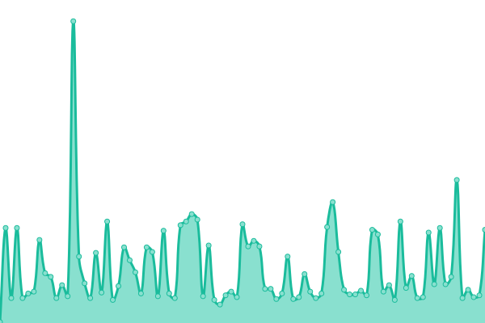

# [📈 Live Status](https://status.zzr.ru): <!--live status--> **🟩 All systems operational**

This repository contains the open-source uptime monitor and status page for [Alexander Miskaryan](https://status.zzr.ru), powered by [Upptime](https://github.com/upptime/upptime).

With [Upptime](https://upptime.js.org), you can get your own unlimited and free uptime monitor and status page, powered entirely by a GitHub repository. We use [Issues](https://github.com/alexmisk/status.zzr.ru/issues) as incident reports, [Actions](https://github.com/alexmisk/status.zzr.ru/actions) as uptime monitors, and [Pages](https://status.zzr.ru) for the status page.

<!--start: status pages-->
<!-- This summary is generated by Upptime (https://github.com/upptime/upptime) -->
<!-- Do not edit this manually, your changes will be overwritten -->
<!-- prettier-ignore -->
| URL | Status | History | Response Time | Uptime |
| --- | ------ | ------- | ------------- | ------ |
|  [zzr.ru](https://zzr.ru) | 🟩 Up | [zzr-ru.yml](https://github.com/AHRJ/status.zzr.ru/commits/HEAD/history/zzr-ru.yml) | 

 1031ms
     
 | 

<a href="https://status.zzr.ru/history/zzr-ru">100.00%</a>
    

|  [dev.zzr.ru](https://dev.zzr.ru) | 🟩 Up | [dev-zzr-ru.yml](https://github.com/AHRJ/status.zzr.ru/commits/HEAD/history/dev-zzr-ru.yml) | 

 174ms
     
 | 

<a href="https://status.zzr.ru/history/dev-zzr-ru">100.00%</a>
    

|  [Control TCP ping](1.1.1.1) | 🟩 Up | [control-tcp-ping.yml](https://github.com/AHRJ/status.zzr.ru/commits/HEAD/history/control-tcp-ping.yml) | 

 70ms
     
 | 

<a href="https://status.zzr.ru/history/control-tcp-ping">100.00%</a>
    

<!--end: status pages-->

[**Visit our status website →**](https://status.zzr.ru)

## 📄 License

- Powered by: [Upptime](https://github.com/upptime/upptime)
- Code: [MIT](./LICENSE) © [Alexander Miskaryan](https://status.zzr.ru)
- Data in the `./history` directory: [Open Database License](https://opendatacommons.org/licenses/odbl/1-0/)
